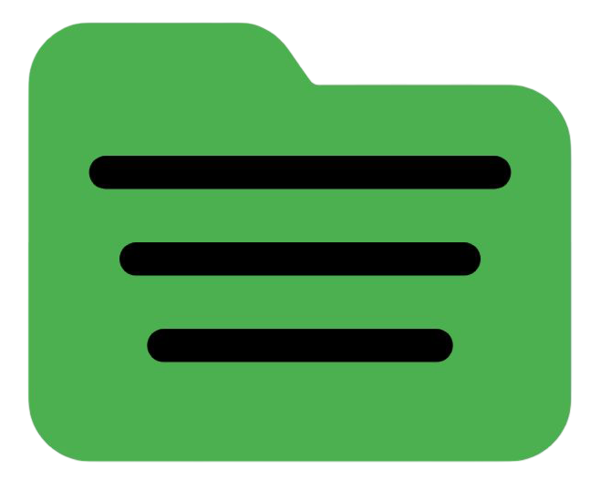
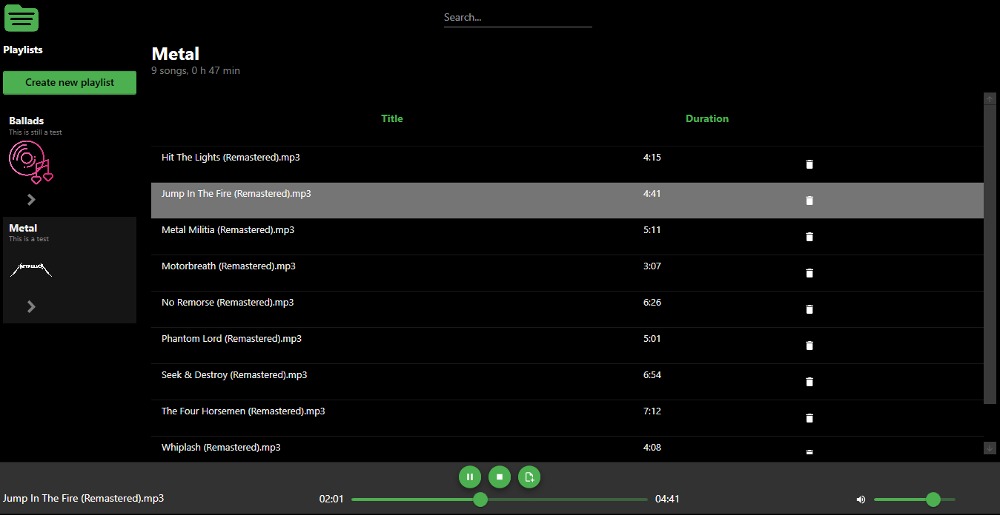

# Localfy



[](README.md)
[](README.es.md)

**Localfy** es un proyecto en desarrollo que busca crear una biblioteca moderna y fácil de usar para archivos de audio locales.



## Características (En Progreso)

Localfy está siendo diseñado para ofrecer una experiencia completa y personalizable para la gestión y reproducción de tu música local:

Las playlists guardan referencias a las canciones en archivos JSON ubicados en:  
```C:\Users\<USER>\AppData\Roaming\Localfy\Playlists\```

- **Playlists Personalizables**: Cada playlist puede tener un título, descripción e imagen distintiva.
- **Gestión de Archivos de Audio**: Agregá y eliminá fácilmente canciones de tus playlists.
- **Reproducción Flexible**: Reproducí, pausá, adelantá, retrocedé y salteá canciones.
- **Filtrado Rápido**: Encontrá tus canciones favoritas al instante usando la barra de búsqueda.
- **Orden Flexible**: Ordená las canciones por álbum, título o duración.
- **Controles de Volumen**: Ajustá el volumen con una barra deslizante intuitiva.
- **Metadatos**: Visualización de título, artista, álbum y duración de las canciones.

## Requisitos

- Windows (x86)
- No requiere instalación ni dependencias externas

## Descarga y Ejecución

- [Descargar ejecutable (v0.1)](https://github.com/ValentinQuiroz/Localfy/releases/download/v0.1/Localfy-v0.1-win-x86.zip)
- Ejecutar ```Localfy.exe```
- Asegurate de crear una playlist para comenzar a agregar canciones.

