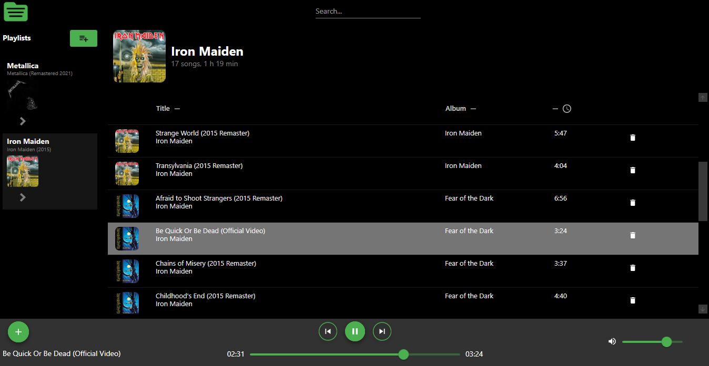

# Localfy


Proyecto en desarrollo que busca crear una biblioteca de archivos de audio local moderna y fácil de usar.

## Descripción
Localfy está construido utilizando WPF sobre .NET 8.0. El objetivo principal es implementar una arquitectura Model-View-ViewModel (MVVM) completa, buscando una separación clara de responsabilidades, lo que facilita el mantenimiento, las pruebas y la escalabilidad del proyecto.




## Características (En Progreso)

Localfy está siendo diseñado para ofrecer una experiencia completa y personalizable para la gestión y reproducción de tu música local:

- Playlists Avanzadas y Personalizables: Las playlists guardan por referencia a las canciones en archivos JSON, ubicados en: ```C:\Users\<USER>\AppData\Roaming\Localfy\Playlists\```.
- Personalización: Cada playlist puede personalizarse con un título, una descripción y una imagen distintiva.
- Gestión de Archivos de Audio: Agregá y eliminá fácilmente archivos de audio a tu playlist.
- Reproducción Flexible: Reproducí, frená, adelantá y retrocedé tus canciones.
- Filtrado Rápido: Encontrá tus canciones favoritas al instante mediante la barra de búsqueda.
- Orden flexible: Ordená las canciones dentro de una playlist alfabéticamente o por duración.
- Controles de volumen: Ajuste de volumen mediante una barra intuitiva.


## Instalación y configuración (Próximamente)

